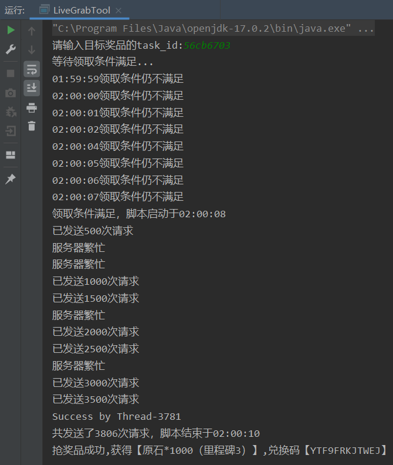
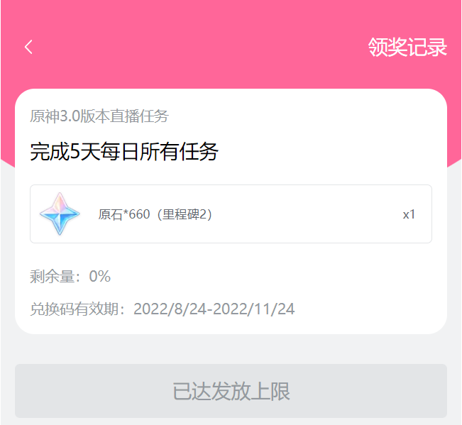
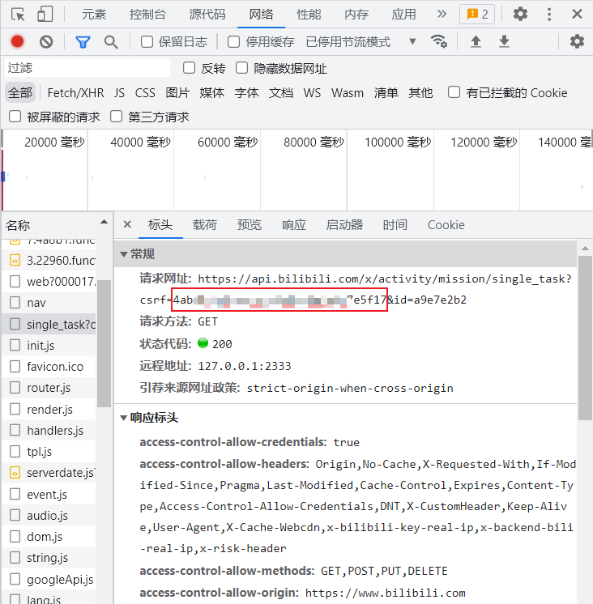
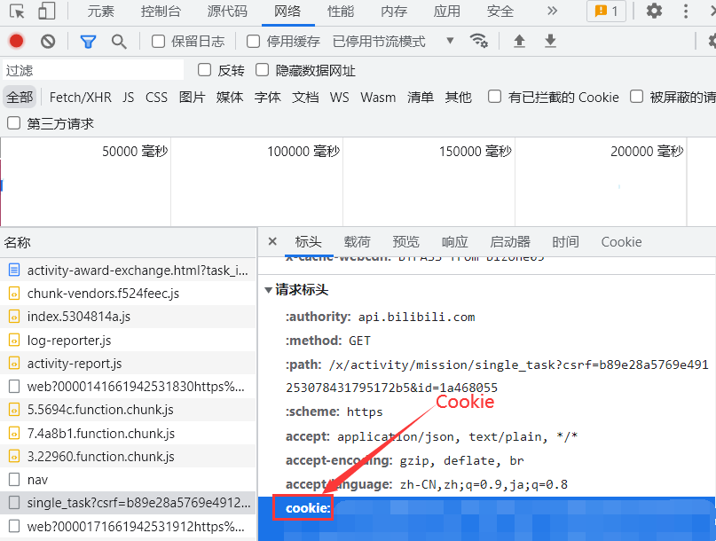
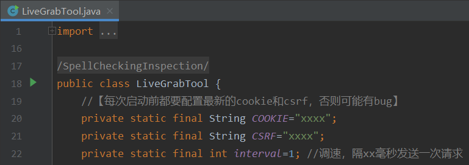
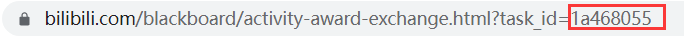

联系我：QQ 836200779

## 运行效果

.

## 使用方法

1. 浏览器进入奖品页面

   .

2. F12打开开发者选项

3. 进入"网络"标签

4. 刷新，找到`single_task`开头的URL，保存CSRF

   .

4. 再在"请求标头"中找到Cookie，右键"复制值"

   .

5. 将获取的CSRF和Cookie填入

   .

6. 启动

7. 输入URL中的task_id

   .
